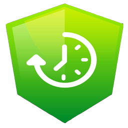

# NGX-Chronology

This is a chronology module and components for Angular projects.



## Badges

[](https://travis-ci.org/JR33D/ngx-chronology)
[](https://www.npmjs.com/package/ngx-chronology)
[](https://github.com/your/your-project/blob/master/LICENSE)
[](http://makeapullrequest.com)

## Installing / Getting started

To get started using the library install from npm

```shell
npm i ngx-chronology --save
```

This will give you access to the module and components available in the library.

### Add module to you NgModule

After installing the library to get access to the features you need to add it to your AppModule.

```ts
import { NgModule } from '@angular/core';
import { BrowserModule } from '@angular/platform-browser';
import { NgxChronologyModule } from 'ngx-chronology';

@NgModule({
   imports: [BrowserModule, NgxChronologyModule],
   declarations: [AppComponent],
})
export class AppModule {}
```

The inside of you app.component.html you can use the component directve like so:

```html
<ngx-chronology [title]="chronologyTitle" [events]="ArrayOfEvents"></ngx-chronology>
```

## Api Reference

The array of events passed to 'ngx-chronology' component should be a set of objects that match the interface:

```ts
export interface IChronologyEvent {
   title: string;
   icon?: string;
   faLibrary: 'far' | 'fas' | 'fab';
   content: string;
}
```

## Want to Contribute?

Go check out our [Contributing Document](/Contribute.md) for more information on getting setup.
